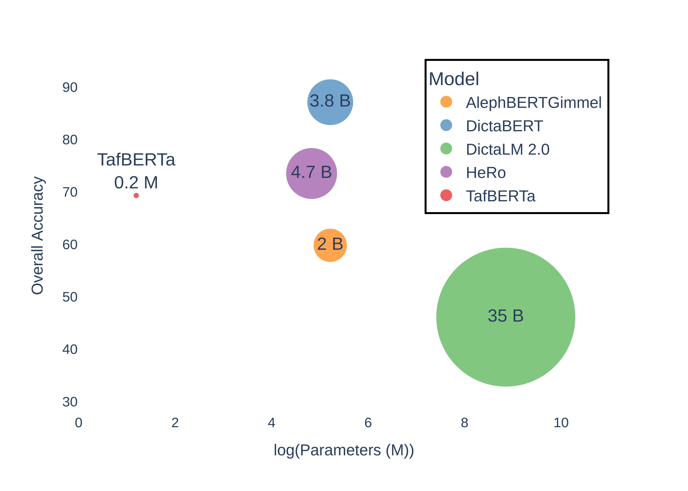
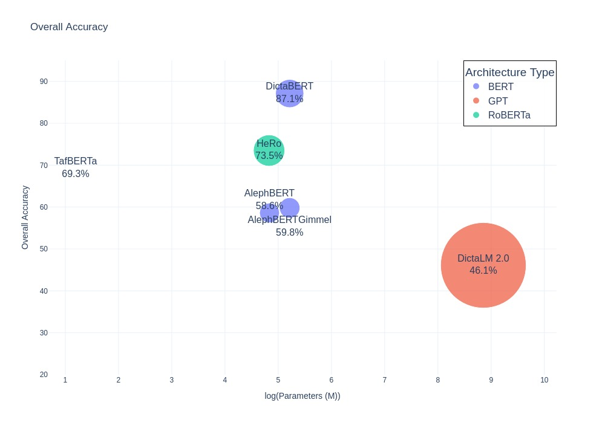

  <strong>TafBERTa</strong> is a compact RoBERTa-style masked language model
  trained on Hebrew child-directed speech (CDS). It is built on top of two
  main resources:

<ul>
  <li><strong>HTBerman</strong>: a curated Hebrew CDS corpus (53K sentences, 233K tokens).</li>
  <li><strong>HeCLiMP</strong>: a grammatical minimal-pairs benchmark that targets
      Determiner–Noun agreement in Hebrew (number &amp; gender).</li>
</ul>

  This repository contains research code for TafBERTa. HTBerman and HeCLiMP.
  
  The research paper is available [here](https://aclanthology.org/).

  

  Overall accuracy of Hebrew language models on the 
  <a href="#heclimp" style="color:#3366cc; text-decoration:none;"><strong>HeCLiMP</strong></a> benchmark. 
  Bubble size represents the number of words seen during training, while the x-axis indicates
  the logarithm of model parameters (M).

<h2 id="about">About</h2>

  TafBERTa is motivated by language acquisition research: can a small model,
  exposed to realistic child-directed speech, learn core grammatical
  regularities of Hebrew?

<ul>
  <li>
    TafBERTa has ~3.3M parameters and a ~7.3K subword vocabulary,
    which is tiny compared to typical Hebrew LMs (&gt;100M params).
  </li>
  <li>
    Training data is not generic web text – it's speech addressed to
    children, aligned and cleaned.
  </li>
  <li>
    We evaluate grammatical knowledge using <strong>HeCLiMP</strong>,
    a minimal-pairs benchmark for Hebrew Determiner–Noun agreement in
    <em>number</em> and <em>gender</em>.
  </li>
</ul>

  We find that TafBERTa can make competitive grammaticality judgments
  compared to large-scale Hebrew LMs, despite being dramatically smaller
  and trained on far less data.

<h2 id="usage-hf-model">Usage (Hugging Face model)</h2>

  Once the model and tokenizer are uploaded to the Hugging Face Hub,
  you can load them like this:

<pre><code class="language-python">
from transformers.models.roberta import RobertaForMaskedLM
from transformers import AutoTokenizer

repo_name = "geanita/tafberta"
tokenizer = AutoTokenizer.from_pretrained(repo_name,
                                          add_prefix_space=True,  # this must be added to produce intended behavior
                                          )
model = RobertaForMaskedLM.from_pretrained(repo_name)

</code></pre>

  You can also point to a local checkpoint directory produced by the
  training script in <code>src/tafberta/training/train_lightning.py</code>.

<h2 id="htberman">HTBerman (Corpus)</h2>

<h3>Data Sources:</h3>

<strong>Example:</strong> השפן הקטן.

<ol>
  <li>CHILDES Hebrew Corpus</li>
</ol>

<table style="border-collapse:collapse; width:80%; margin-left:1em; font-family:'Segoe UI',sans-serif; font-size:14px;">
  <thead style="background-color:#f8f9fa;">
    <tr>
      <th style="border:1px solid #ccc; padding:6px; text-align:left;">Father:</th>
      <th style="border:1px solid #ccc; padding:6px; text-align:center;">ha</th>
      <th style="border:1px solid #ccc; padding:6px; text-align:center;">safan</th>
      <th style="border:1px solid #ccc; padding:6px; text-align:center;">ha</th>
      <th style="border:1px solid #ccc; padding:6px; text-align:center;">qatan</th>
    </tr>
  </thead>
  <tbody>
    <tr style="background-color:#f9f9f9;">
      <td style="border:1px solid #ccc; padding:6px; text-align:left;">%mor:</td>
      <td style="border:1px solid #ccc; padding:6px; text-align:center;">det|the</td>
      <td style="border:1px solid #ccc; padding:6px; text-align:center;">n|gen:ms&amp;num:sg</td>
      <td style="border:1px solid #ccc; padding:6px; text-align:center;">det|the</td>
      <td style="border:1px solid #ccc; padding:6px; text-align:center;">adj|root:qtn&amp;gen:ms&amp;num:sg</td>
    </tr>
  </tbody>
</table>

<ol start="2">
  <li>Standard Hebrew Corpus: Rewritten in standard orthography</li>
</ol>

<h4 style="margin-left:1em;">Final dataset:</h4>

<table style="border-collapse:collapse; width:80%; margin-left:1em; font-family:'Segoe UI',sans-serif; font-size:14px;">
  <thead style="background-color:#f8f9fa;">
    <tr>
      <th style="border:1px solid #ccc; padding:6px; text-align:left;">Father:</th>
      <th style="border:1px solid #ccc; padding:6px; text-align:center;">ha</th>
      <th style="border:1px solid #ccc; padding:6px; text-align:center;">safan</th>
      <th style="border:1px solid #ccc; padding:6px; text-align:center;">ha</th>
      <th style="border:1px solid #ccc; padding:6px; text-align:center;">qatan</th>
    </tr>
  </thead>
  <tbody>
    <tr style="background-color:#f9f9f9;">
      <td style="border:1px solid #ccc; padding:6px; text-align:left;">%mor:</td>
      <td style="border:1px solid #ccc; padding:6px; text-align:center;">det|the</td>
      <td style="border:1px solid #ccc; padding:6px; text-align:center;">n|gen:ms&amp;num:sg</td>
      <td style="border:1px solid #ccc; padding:6px; text-align:center;">det|the</td>
      <td style="border:1px solid #ccc; padding:6px; text-align:center;">adj|root:qtn&amp;gen:ms&amp;num:sg</td>
    </tr>
    <tr>
      <td style="border:1px solid #ccc; padding:6px; text-align:left;">—</td>
      <td style="border:1px solid #ccc; padding:6px; text-align:center;">ה</td>
      <td style="border:1px solid #ccc; padding:6px; text-align:center;">שפן</td>
      <td style="border:1px solid #ccc; padding:6px; text-align:center;">ה</td>
      <td style="border:1px solid #ccc; padding:6px; text-align:center;">קטן</td>
    </tr>
  </tbody>
</table>

 

 

<strong>HTBerman</strong> is our cleaned, aligned corpus of Hebrew CDS.

<ul>
  <li>53K sentences, 233K tokens, ~8K unique word types.</li>
  <li>
    Created by merging:
    <ul>
      <li>
        The CHILDES Berman Longitudinal Corpus (Hebrew speech transcribed
        phonetically in Latin characters, with rich metadata).
      </li>
      <li>
        A version of the same recordings transcribed in standard Hebrew script.
      </li>
    </ul>
  </li>
  <li>
    We align utterances and tokens across the two versions and propagate
    the morphological annotations to the Hebrew-script side.
  </li>
  <li>
    We keep only CDS produced by caregivers / adults (e.g. MOT, FAT, GM, GF),
    not the child's own productions (<code>participant != "CHI"</code>).
  </li>
</ul>

  The result is a Hebrew-script CDS corpus with token-level morphological
  metadata, suitable for both language modeling and controlled evaluation.

  The full preprocessing pipeline for HTBerman is implemented under:

<pre><code>
src/tafberta/data/preparation/htberman_prepare.py
src/tafberta/data/preprocessing/htberman_preprocessing_pipeline.py
</code></pre>

Key intermediate outputs include:

<ul>
  <li><code>aligned_pairs.jsonl</code> – utterance-level pairs with speaker, English gloss, Hebrew line, and %mor.</li>
  <li><code>aligned_pairs_token.jsonl</code> – sentence-level alignment status after token fixes.</li>
  <li><code>aligned_tokens.jsonl</code> – per-token records: Hebrew token, aligned English transcription, parsed %mor features.</li>
  <li><code>corpus_utt_aligned.txt</code> – plain-text Hebrew corpus used to train TafBERTa.</li>
</ul>

<h2 id="heclimp">HeCLiMP (Benchmark)</h2>

  <strong>HeCLiMP</strong> (Hebrew Child-Directed Linguistic Minimal Pairs) is a
  grammaticality benchmark built from HTBerman. It focuses on agreement
  between a demonstrative determiner and a following noun.

  We generate <em>minimal pairs</em> that differ in exactly one feature:

<ul>
  <li><strong>Number agreement</strong> (singular vs. plural)</li>
  <li><strong>Gender agreement</strong> (masculine vs. feminine)</li>
</ul>

  For each noun (which we annotate for grammatical number and gender),
  we pair it with Hebrew demonstratives like &quot;זה / זו / אלה / אלו / הוא / היא / הם / הן&quot;.
  We then form correct and incorrect sentences such as:

<pre><code>תסתכל על ה &lt;NOUN&gt; ה&lt;DEMONSTRATIVE&gt; .</code></pre>

  Output structure (per paradigm):

<ul>
  <li>
    <code>agreement_determiner_noun-across_0_adjective_num/all_data.txt</code> 
    alternating lines: incorrect-number, correct-number.
  </li>
  <li>
    <code>agreement_determiner_noun-across_0_adjective_gen/all_data.txt</code> 
    alternating lines: incorrect-gender, correct-gender.
  </li>
</ul>

  We then split each set into <code>dev.txt</code> (20%) and <code>test.txt</code> (80%).

  Code that builds and splits HeCLiMP:

<pre><code>
src/tafberta/data/preparation/heclimp_prepare.py          # extract usable nouns from aligned_tokens.jsonl
src/tafberta/data/preprocessing/heclimp_builder.py        # create minimal pairs (all_data.txt)
src/tafberta/data/preprocessing/heclimp_split_all_data.py # split into dev/test
</code></pre>

<h3>Hebrew Models Comparison Accuracy on HeCLiMP Paradigms</h3>

  
  
  

<h2 id="tafberta-vs-hero">TafBERTa vs. HeRo</h2>

  TafBERTa is intentionally small and specifically tuned for Hebrew child-directed speech (CDS).
  While HeRo represents a large-scale Hebrew RoBERTa trained on web-scale data, TafBERTa focuses
  on efficiency, interpretability, and language acquisition plausibility.

  The following table summarizes the main quantitative differences between the two models,
  as reported in the TafBERTa ACL paper:

<h3 style="margin-top:1em;">HeRo vs. TafBERTa Comparison</h3>

<h4>Parameters Comparison</h4>

  

<h4>Data Size Comparison</h4>

  

<table style="border-collapse:collapse; width:80%; margin:1em 0; font-family:'Segoe UI',sans-serif; font-size:14px; text-align:center;">
  <thead style="background-color:#f8f9fa;">
    <tr>
      <th style="border:1px solid #ccc; padding:6px; text-align:left;">Metric</th>
      <th style="border:1px solid #ccc; padding:6px;">HeRo</th>
      <th style="border:1px solid #ccc; padding:6px;">TafBERTa</th>
    </tr>
  </thead>
  <tbody>
    <tr><td style="border:1px solid #ccc; padding:6px; text-align:left;">Parameters</td><td style="border:1px solid #ccc; padding:6px;">125M</td><td style="border:1px solid #ccc; padding:6px;">3.3M</td></tr>
    <tr><td style="border:1px solid #ccc; padding:6px; text-align:left;">Data size</td><td style="border:1px solid #ccc; padding:6px;">47.5GB</td><td style="border:1px solid #ccc; padding:6px;">1.8MB</td></tr>
    <tr><td style="border:1px solid #ccc; padding:6px; text-align:left;">Words in data</td><td style="border:1px solid #ccc; padding:6px;">4.7B</td><td style="border:1px solid #ccc; padding:6px;">233K</td></tr>
    <tr><td style="border:1px solid #ccc; padding:6px; text-align:left;">Batch size</td><td style="border:1px solid #ccc; padding:6px;">8k</td><td style="border:1px solid #ccc; padding:6px;">128</td></tr>
    <tr><td style="border:1px solid #ccc; padding:6px; text-align:left;">Max sequence</td><td style="border:1px solid #ccc; padding:6px;">512</td><td style="border:1px solid #ccc; padding:6px;">128</td></tr>
    <tr><td style="border:1px solid #ccc; padding:6px; text-align:left;">Epochs</td><td style="border:1px solid #ccc; padding:6px;">25</td><td style="border:1px solid #ccc; padding:6px;">5</td></tr>
    <tr><td style="border:1px solid #ccc; padding:6px; text-align:left;">Hardware</td><td style="border:1px solid #ccc; padding:6px;">1×GTX1080</td><td style="border:1px solid #ccc; padding:6px;">1×RTX6000</td></tr>
    <tr><td style="border:1px solid #ccc; padding:6px; text-align:left;">Training time</td><td style="border:1px solid #ccc; padding:6px;">35 days</td><td style="border:1px solid #ccc; padding:6px;">105 seconds</td></tr>
    <tr style="background-color:#f2f2f2;">
      <td colspan="3" style="border:1px solid #ccc; padding:6px; text-align:center; font-weight:bold;">Model Configurations</td>
    </tr>
    <tr><td style="border:1px solid #ccc; padding:6px; text-align:left;">Vocabulary size</td><td style="border:1px solid #ccc; padding:6px;">50K</td><td style="border:1px solid #ccc; padding:6px;">7317</td></tr>
    <tr><td style="border:1px solid #ccc; padding:6px; text-align:left;">Hidden size</td><td style="border:1px solid #ccc; padding:6px;">768</td><td style="border:1px solid #ccc; padding:6px;">64</td></tr>
    <tr><td style="border:1px solid #ccc; padding:6px; text-align:left;">Layers number</td><td style="border:1px solid #ccc; padding:6px;">12</td><td style="border:1px solid #ccc; padding:6px;">10</td></tr>
    <tr><td style="border:1px solid #ccc; padding:6px; text-align:left;">Attention heads</td><td style="border:1px solid #ccc; padding:6px;">12</td><td style="border:1px solid #ccc; padding:6px;">4</td></tr>
    <tr><td style="border:1px solid #ccc; padding:6px; text-align:left;">Intermediate size</td><td style="border:1px solid #ccc; padding:6px;">3072</td><td style="border:1px solid #ccc; padding:6px;">2048</td></tr>
    <tr><td style="border:1px solid #ccc; padding:6px; text-align:left;">Max sequence</td><td style="border:1px solid #ccc; padding:6px;">512</td><td style="border:1px solid #ccc; padding:6px;">128</td></tr>
    <tr style="background-color:#f9f9f9; font-weight:bold;">
      <td style="border:1px solid #ccc; padding:6px; text-align:left;">Accuracy *</td>
      <td style="border:1px solid #ccc; padding:6px;">73.5</td>
      <td style="border:1px solid #ccc; padding:6px;">69.3</td>
    </tr>
  </tbody>
</table>

*Accuracy measured on the HeCLiMP benchmark.

  TafBERTa achieves near-HeRo accuracy on grammatical agreement,
  despite being over <strong>35× smaller</strong> and trained on
  <strong>~1/2000th of the data</strong>. This demonstrates that grammatical
  regularities in Hebrew can be learned from realistic child-directed input,
  without relying on massive web-scale corpora.

<h2 id="pre-processing-pipeline">Pre-processing Pipeline</h2>

  The data pipeline in this repo mirrors the process described in the paper.

<ol>
  <li>
    <strong>File-level preparation</strong> 
    - Copy only relevant CHILDES session files. 
    - Safe renaming to resolve filename collisions. 
    - Remove blanks and non-speech logs; reorder Hebrew files to match the
      English (Latin-script) transcript order.
      
    <code>python -m tafberta.data.preparation.htberman_prepare</code>
  </li>

  <li>
    <strong>Utterance-level alignment</strong> 
    - Pair each Hebrew file with its Latin transcript by index (not filename). 
    - For 64 problematic files, drop specific &quot;extra&quot; lines to equalize length. 
    - Align utterances and attach CHILDES metadata (speaker, %mor). 
    - Keep only CDS: discard lines where <code>participant == "CHI"</code>.  
    <code>python -m tafberta.data.preprocessing.htberman_utterance_matcher</code>
  </li>

  <li>
    <strong>Token-level alignment &amp; cleanup</strong> 
    Apply scripted Hebrew-side edits to maximize 1:1 token alignment: 
    <ul>
      <li>Hebrew segmentation using a pretrained Hebrew segmenter.</li>
      <li>Merge split child names (&quot;ה גרי&quot; → &quot;הגרי&quot;, etc.).</li>
      <li>Join words that should be single tokens (&quot;ל כאן&quot; → &quot;לכאן&quot;).</li>
      <li>Split off clitics / prefixes (&quot;בזה&quot; → &quot;ב זה&quot;, etc.).</li>
      <li>Repair missing Hebrew letter ג where Latin transcription has a /j/ sound.</li>
      <li>Remove random junk characters.</li>
      <li>Normalize punctuation spacing and insert missing punctuation where attested in the Latin transcript.</li>
      <li>Handle prepositions, conjunctions, and multi-word expressions (&quot;עוד פעם&quot; → &quot;עוד_פעם&quot;).</li>
    </ul>
    

    The script also attempts a second pass of preposition/clitic fixes after
    multi-word expression normalization, to maintain correct token indices.
      
    <code>python -m tafberta.data.preprocessing.htberman_token_matcher</code>
    

  </li>

  <li>
    <strong>HeCLiMP construction</strong> 
    - Extract nouns with number/gender info from <code>%mor</code>. 
    - Pair each noun with matching and mismatching Hebrew demonstratives. 
    - Emit minimal pairs where only agreement is wrong. 
     
    <code>python -m tafberta.data.preparation.heclimp_prepare</code> 
    <code>python -m tafberta.data.preprocessing.heclimp_builder</code> 
    <code>python -m tafberta.data.preprocessing.heclimp_split_all_data</code>
  </li>
</ol>

<h2 id="replication">Replication</h2>

<h3>Environment</h3>

<pre><code class="language-bash">
python3 -m venv .venv
source .venv/bin/activate
python -m pip install --upgrade pip
pip install -r requirements.txt

</code></pre>

<h3>Data build</h3>

<pre><code class="language-bash">
# Build HTBerman aligned data + tokens
python -m tafberta.data.preparation.htberman_prepare
python -m tafberta.data.preprocessing.htberman_preprocessing_pipeline

# Build HeCLiMP benchmark
python -m tafberta.data.preparation.heclimp_prepare
python -m tafberta.data.preprocessing.heclimp_builder
python -m tafberta.data.preprocessing.heclimp_split_all_data
</code></pre>

<h3>Training TafBERTa</h3>

<pre><code class="language-bash">
python -m tafberta.training.train_lightning \
  --train_corpus data/processed/htberman/corpus_utt_aligned.txt \
  --tokenizer   src/tafberta/tokenizers/htberman_tokenizer.json \
  --epochs 10 \
  --batch_size 64 \
  --lr 5e-5 \
  --out_dir runs/tafberta
</code></pre>

<h2 id="compatibility">Compatibility</h2>

<ul>
  <li><strong>Python</strong>: 3.8 – 3.11</li>
  <li><strong>OS</strong>: Linux, macOS, WSL</li>
  <li>
    <strong>Hardware</strong>: single GPU (we trained on a single RTX6000).
  </li>
</ul>

  <em>Licensing note:</em> CHILDES / TalkBank data is subject to its own
  license and ethical use requirements.

<h2 id="citation">Citation</h2>

  If you use TafBERTa, HTBerman, or HeCLiMP, please cite:

<blockquote>
  TafBERTa: Learning Grammatical Rules from Small-Scale Language
  Acquisition Data in Hebrew. [Preprint / ACL submission].
</blockquote>
